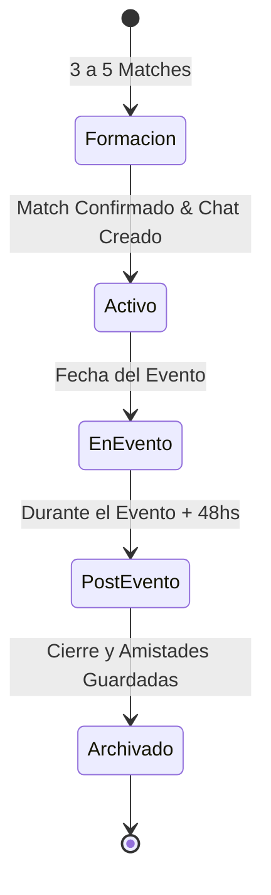

# Especificaciones del Producto: Squad Matcher de Eventos (root)

> **Iniciativa:** Sistema de descubrimiento de eventos y formación automática de grupos ("Squad Matcher") para eventos de música electrónica en **root**.  
> **Versión:** 1.0.0  
> **Estado:** Aprobado para desarrollo  
> **Fecha:** Agosto 2026  

---

## 1. Resumen Ejecutivo & Visión del Producto

### 1.1 El Problema
En la escena de eventos masivos y música electrónica (festivales, clubs, open airs):
- Un porcentaje significativo de usuarios (35-45%) se encuentra con el obstáculo de **no tener con quién asistir** debido a discrepancias de gustos musicales con sus círculos tradicionales, costos o viajes en solitario.
- Los modelos de emparejamiento 1 a 1 tradicionales (estilo Tinder / dating) generan **presión social, incomodidad, ambigüedad de intenciones y fricción de seguridad**.

### 1.2 La Solución: Squad Matching para Eventos
Transformar el descubrimiento de eventos en una experiencia lúdica e interactiva mediante una mecánica de **Swipe**, complementada por un **motor de formación de grupos reducidos (Squads de 3 a 5 personas)**.

Al coincidir en el interés por un evento y compartir afinidades de salida, el sistema empareja a los usuarios en un **chat grupal temporal exclusivo del evento**, eliminando la incomodidad del 1 a 1 y potenciando la camaradería, la seguridad y la logística nocturna (previa, transporte, reventa y punto de encuentro).

---

## 2. Perfil de Usuario & Parámetros de Afinidad (Vibe Profile)

Cada usuario configura sus parámetros de salida y preferencias para optimizar la compatibilidad del algoritmo:

### 2.1 Dimensiones de Compatibilidad
1. **Subgéneros Musicales Favoritos:**
   - *Melodic Techno*, *Hard Techno*, *Tech House*, *Progressive House*, *Minimal / Deep Tech*, *Trance / Psytrance*, *Afro House*.
2. **Zona Geográfica / Salida:**
   - *Palermo / Recoleta*, *Costanera / Puerto Madero*, *Zona Norte (San Isidro/Vicente López)*, *Zona Sur*, *Zona Oeste*, *La Plata*.
3. **Vibra y Estilo de Salida (Party Style):**
   - **Chill & Previa:** Gustan de juntarse temprano antes del club.
   - **All-Night:** Salida completa desde apertura hasta el cierre (after hours).
   - **Main Act Only:** Foco exclusivo en los horarios del DJ principal.
4. **Verificación & Filtros de Confianza:**
   - Badge de identidad **KYC Verificado** (DNI/Biometría).
   - Filtro optativo: *Squads únicamente con integrantes verificados*.
   - Filtro optativo: *Squads exclusivos de mujeres / safe-space*.

---

## 3. Mecánica de Interacción & Descubrimiento (Swipe Deck)

### 3.1 Gestos y Acciones
* **⬅️ Swipe Izquierda (Pass / No me interesa):** Descarta el evento de la pila actual.
* **➡️ Swipe Derecha (Interés + Modo Squad):** Registra el interés y postula al usuario para entrar en el pool de matching de ese evento.
* **⚡ Super Swipe / Flame (Tengo Ticket / Urgente):** Otorga prioridad máxima en la cola de asignación de Squad para dicho evento.
* **Botones de acción táctiles:** Controles flotantes inferiores para usuarios que prefieran no usar gestos de arrastre táctil.

### 3.2 Anatomía de la Tarjeta Cinemática de Evento (`SwipeCard`)
- **Visual:** Banner póster en formato vertical con gradiente cinematográfico oscuro.
- **Información Clave:** Título del evento, fecha destacada, locación y lineup confirmado con badges interactivos.
- **Indicador de Compatibilidad:** Nivel de afinidad musical basado en los artistas del evento vs. gustos del usuario (ej. *"96% Match Musical"*).
- **Contador en Vivo:** *"48 personas buscando Squad para este evento"*.

---

## 4. Motor de Matchmaking (Squad Engine)

### 4.1 Reglas de Conformación de Grupos
* **Tamaño Óptimo del Squad:** 3 a 5 integrantes.
* **Ventana de Formación:** El grupo se activa automáticamente apenas 3 o más personas compatibles emiten su Swipe Derecha.
* **Criterios de Agrupación:**
  1. Mismo Evento (`eventId`).
  2. Proximidad geográfica de partida (`departureZone`).
  3. Coincidencia en estilo de salida (`partyStyle`).
  4. Preferencias de seguridad (KYC / Safe-Space).

### 4.2 Estados del Ciclo de Vida del Squad


1. **Formación (`forming`):** Búsqueda de candidatos en cola de espera.
2. **Activo (`active`):** Notificación de match simultánea y apertura de la sala de chat.
3. **En Evento (`in_event`):** Fijación del punto de encuentro dentro del predio y chat en tiempo real.
4. **Post-Evento (`post_event`):** Ventana de 48 hs para intercambio de fotos, videos y agregar a los integrantes como amigos en root.
5. **Archivado (`archived`):** El chat se guarda en el historial de salidas.

---

## 5. Experiencia del Chat Grupal (`SquadChatRoom`)

### 5.1 Onboarding & Mensaje Icebreaker Automático
Al abrir el chat, un bot asistente de root publica un mensaje contextual fijado:
> *"¡Match de Squad para **Afterlife Buenos Aires**! 🎧  
> 4 integrantes conectados desde **Palermo** y **Zona Norte**. Todos van en modo **All-Night**.  
> ¿Quién coordina la previa o el transporte?"*

### 5.2 Módulos Integrados dentro del Chat
* **🎟️ Acceso Directo a Reventa KYC:** Ver tickets disponibles o vender pases sobrantes directamente dentro del grupo con transferencia asegurada.
* **📍 Punto de Encuentro:** Marcador fijable para reunirse dentro del venue (ej. *"Carpa de Hidratación Izquierda"*).
* **🚗 División de Gastos / Movilidad:** Selector rápido para coordinar Uber / Auto compartido.

---

## 6. Modelo de Datos (TypeScript Definitions)

```typescript
// Perfil de afinidades del usuario
export interface UserVibeProfile {
  userId: string;
  favoriteGenres: string[];
  departureZone: string;
  partyStyle: 'chill_previa' | 'full_night' | 'main_act_only';
  verifiedKycOnly: boolean;
  spotifyConnected?: boolean;
}

// Acción de Swipe
export interface EventSwipeAction {
  id: string;
  userId: string;
  eventId: string;
  direction: 'like' | 'pass' | 'superlike';
  lookingForSquad: boolean;
  timestamp: string;
}

// Integrante del Squad
export interface SquadMember {
  userId: string;
  hasTicket: boolean;
  joinedAt: string;
  role: 'member' | 'host';
}

// Entidad Squad
export interface EventSquad {
  id: string;
  eventId: string;
  name: string;
  members: SquadMember[];
  matchScore: number;
  departureZone: string;
  chatRoomId: string;
  status: 'forming' | 'active' | 'in_event' | 'post_event' | 'archived';
  createdAt: string;
  expiresAt: string;
}

// Mensaje de Chat de Squad
export interface SquadChatMessage {
  id: string;
  squadId: string;
  senderId: string;
  content: string;
  type: 'text' | 'image' | 'system_icebreaker' | 'meeting_point' | 'ticket_share';
  metadata?: Record<string, unknown>;
  timestamp: string;
}
```

---

## 7. Arquitectura de Componentes & Rutas

### 7.1 Rutas de la Aplicación
* `/match` — Vista principal del Swipe Deck de eventos y selector de filtros de vibra.
* `/match/preferences` — Configuración del *Vibe Profile* del usuario.
* `/chat/squad/[id]` — Sala de chat grupal del Squad con panel de herramientas.

### 7.2 Jerarquía de Componentes Frontend
```
src/
├── app/
│   ├── match/
│   │   ├── page.tsx                    # Vista principal del Swipe Deck
│   │   └── preferences/page.tsx        # Configuración de perfil de vibra
│   └── chat/
│       └── squad/[id]/page.tsx         # Chat de Squad interactivo
└── components/
    └── match/
        ├── EventSwipeDeck.tsx          # Contenedor interactivo del deck con gestos
        ├── SwipeCard.tsx               # Tarjeta cinemática individual con tags
        ├── SwipeControls.tsx           # Botones flotantes (Pass, Super, Like)
        ├── SquadMatchModal.tsx         # Modal cinematográfico de celebración de match
        ├── VibeFilterDrawer.tsx        # Drawer para cambiar zona/estilo rápidamente
        └── SquadChatHeader.tsx         # Cabecera de chat con datos del evento y miembros
```

---

## 8. Fases de Desarrollo (Plan de Ejecución del Track)

| Fase | Alcance | Entregables Clave |
| :--- | :--- | :--- |
| **Fase 1: Vibe Profile & Modelos** | Definición de tipos, mock data de squads y selector de preferencias de salida. | `UserVibeProfile`, mocks extendidos en `mocks.ts`, componente de configuración. |
| **Fase 2: Deck de Swipe Interactivo** | Componente visual `EventSwipeDeck` con animaciones táctiles, gestos de arrastre y controles flotantes. | `EventSwipeDeck.tsx`, `SwipeCard.tsx`, `SwipeControls.tsx`. |
| **Fase 3: Motor de Matching & Notificación** | Lógica de detección de match al completar el cupo y modal cinematográfico de celebración. | `SquadMatchModal.tsx`, estado global de matches. |
| **Fase 4: Chat Grupal & Utilidades** | Integración del chat de Squad en `/chat`, mensajes automáticos de bienvenida y accesos rápidos a tickets. | `SquadChatRoom`, vinculación con reventa y perfiles. |
| **Fase 5: Testing & Pulido UX** | Validación responsive, micro-animaciones *acid-lime* y compatibilidad de temas. | Pruebas end-to-end y build de producción. |
