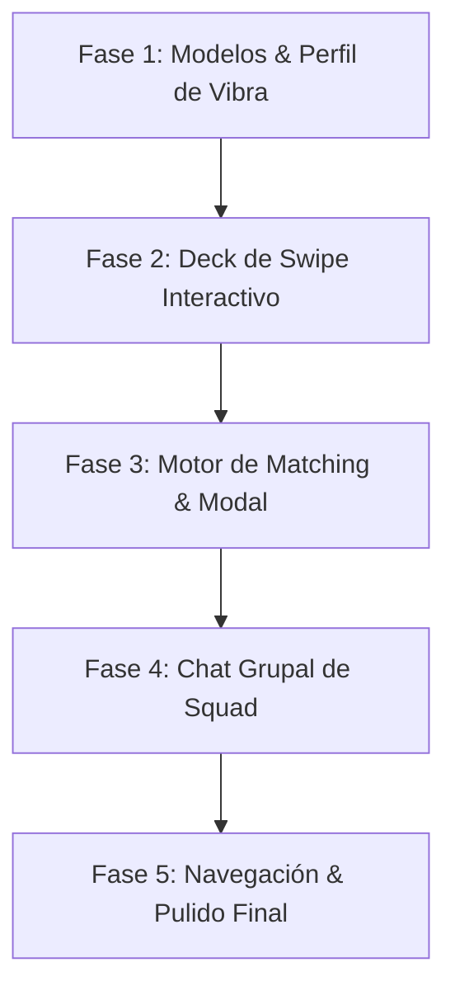

# Plan de Ejecución (Track): Squad Matcher de Eventos

> **Objetivo:** Implementar la experiencia completa de descubrimiento por Swipe y formación automática de Squads (grupos de 3-5 personas) para eventos de música electrónica en **root**.
> **Ruta Base:** `/match`
> **Estado:** ✅ Completado e Integrado

---

## 📋 Resumen de Fases y Tareas

---

## 🎯 Fase 1: Modelos de Datos, Mocks & Perfil de Vibra

- [x] **1.1 Actualizar Modelos de Datos en `src/lib/mocks.ts`**
  - Agregar interfaces: `UserVibeProfile`, `EventSquad`, `SquadMember`, `SquadChatMessage`, `EventSwipeAction`.
  - Crear mock data de perfiles de vibra y squads existentes de ejemplo.
- [x] **1.2 Crear Contexto / Store de Match (`src/context/MatchContext.tsx`)**
  - Manejo de estado del swipe (eventos vistos, likes, superlikes, squads formados).
  - Estado del perfil de vibra del usuario actual con persistencia local (`localStorage` o state).
- [x] **1.3 Crear Drawer / Modal de Preferencias de Vibra (`VibePreferencesDrawer.tsx`)**
  - Selector de subgéneros musicales favoritos (píldoras interactivas con acento `#D4FF00`).
  - Selector de zona de salida (Palermo, Costanera, Zona Norte, etc.).
  - Selector de estilo de noche (*Previa Chill*, *All-Night*, *Main Act Only*).
  - Toggle de filtro de seguridad (*Solo perfiles KYC verificados*).

---

## 🃏 Fase 2: Swipe Deck Interactivo (`/match`)

- [x] **2.1 Crear Componente `SwipeCard.tsx`**
  - Diseño cinematográfico vertical (aspect ratio 9:16 o 2:3) con fondo del poster del evento.
  - Gradiente obsidian inferior con badge de fecha, locación y tags de lineup.
  - Indicador dinámico de compatibilidad (*"94% Match Musical"*).
  - Badge en vivo: *"X personas buscando Squad"*.
  - Indicadores visuales de arrastre (*"MATCH / SQUAD"* en verde y *"PASS"* en gris al deslizar).
- [x] **2.2 Crear Contenedor `EventSwipeDeck.tsx`**
  - Pila apilada de tarjetas (card stack) con efecto de profundidad y escala.
  - Soporte para gestos táctiles y arrastre con mouse (smooth drag, rotación y descarte).
  - Estado de deck vacío ("*Has visto todos los eventos por ahora*") con botón de reiniciar o ajustar filtros.
- [x] **2.3 Crear Barra de Controles Flotantes `SwipeControls.tsx`**
  - Botón ❌ **Descartar (Pass)** (circular, fondo obsidian, icono X).
  - Botón ⚡ **Super Squad (Prioridad)** (circular con glow acid-lime, icono rayo/flame).
  - Botón 💚 **Quiero Ir / Buscar Squad** (circular agrandado, acento #D4FF00, icono Check/Users).
  - Botón ⚙️ **Filtros de Vibra** (abre el drawer de preferencias).
- [x] **2.4 Crear Página Principal `/match/page.tsx`**
  - Header obsidian con logo, selector de modo y contador de matches activos.

---

## ⚡ Fase 3: Motor de Matching & Modal de Celebración

- [x] **3.1 Algoritmo Simulador de Matchmaking**
  - Al hacer Swipe Derecho en un evento, verificar si se completa un Squad con los usuarios mock.
  - Lógica para agrupar 3 a 4 personas compatibles automáticamente.
- [x] **3.2 Componente `SquadMatchModal.tsx`**
  - Animación cinematográfica tipo overlay con confeti/partículas obsidian y sonido visual.
  - Título: *"¡MATCH DE SQUAD FORMADO! 🎉"*.
  - Muestra del póster del evento y avatars de los 3-4 integrantes del nuevo squad con sus zonas de partida.
  - Botones de acción:
    - *"Entrar al Chat del Squad"* (redirige al chat grupal).
    - *"Seguir Explorando"*.

---

## 💬 Fase 4: Chat Grupal de Squad & Utilidades

- [x] **4.1 Crear Vista de Chat de Squad (`/chat/squad/[id]/page.tsx`)**
  - Cabecera con poster miniatura del evento, cuenta regresiva de días y lista de miembros.
  - Mensaje fijado automático del bot de root (*Icebreaker con zona de previa y artistas favoritos en común*).
  - Muro de mensajes en tiempo real (enviar y recibir mensajes en el grupo).
- [x] **4.2 Módulos de Utilidad dentro del Chat**
  - **Punto de Encuentro:** Tarjeta interactiva con mapa o ubicación dentro del predio.
  - **Reventa de Tickets KYC:** Acceso rápido para ofrecer o solicitar entradas verificadas al grupo.
- [x] **4.3 Integrar Squads Activos en la Lista General de Chats (`/chat`)**
  - Sección superior con badges de *"Tus Squads de Eventos"* diferenciados de los chats 1 a 1.

---

## 🚀 Fase 5: Integración Global, BottomNav & Pulido UX

- [x] **5.1 Actualizar Navegación Global (`BottomNav.tsx`)**
  - Integrar acceso directo al modo **Match** con icono de radar/flame y badge de notificaciones de match.
- [x] **5.2 Acceso desde el Detalle de Evento (`/events/[id]`)**
  - Añadir banner o botón secundario: *"Buscar Squad para este evento"* que abre el matcher filtrado directamente para esa fecha.
- [x] **5.3 Pruebas de Rendimiento, Responsive & Verificación de TypeScript**
  - Validación con `npx tsc --noEmit` y pruebas táctiles fluidas.

---

## 📊 Criterios de Aceptación

1. **Gestos Fluidos:** El usuario puede deslizar tarjetas tanto con arrastre táctil/mouse como mediante los botones inferiores.
2. **Generación Instantánea de Squad:** Al hacer swipe derecho a un evento, el sistema simula o empareja un grupo de 3-4 personas compatibles y despliega el modal de celebración.
3. **Chat Operativo:** El usuario puede entrar a la sala del Squad, ver el mensaje de bienvenida contextual y chatear con los miembros.
4. **Diseño Coherente:** 100% integrado con el estilo visual Obsidian Glassmorphism y detalles *acid-lime* (`#D4FF00`) de **root**.
